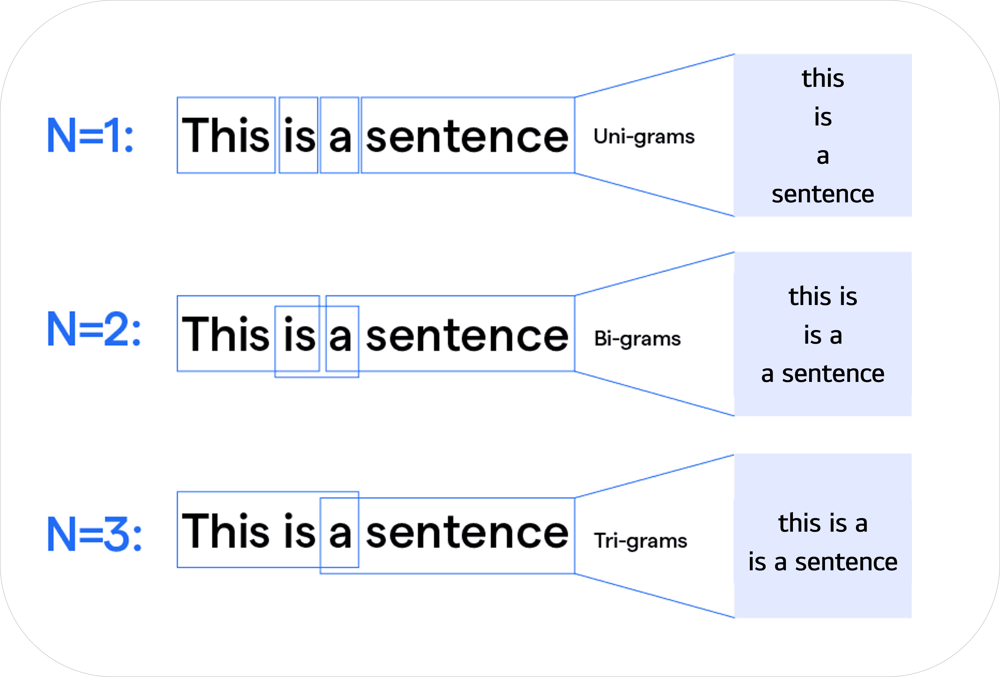
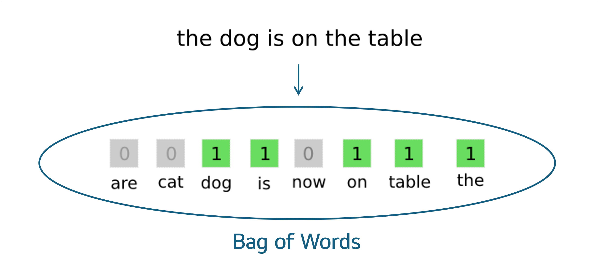
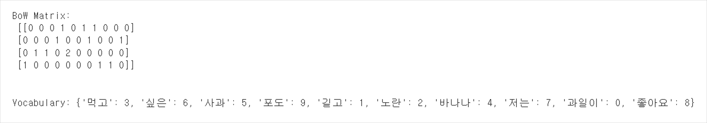

# NLP 단어 표현 기법 실습

<br>

자연어처리(NLP)에서 텍스트는 기계가 이해할 수 있는 수치 형태로 변환되어야 한다.

단어 벡터화는 고정된 차원의 벡터로 의미와 문맥을 표현해, 기계학습 모델이 계산하고 학습할 수 있게 한다.

본 실습에서는 기초적인 통계적 모델부터 신경망 기반 임베딩까지 대표적인 단어 표현 기법들을 구현해본다.

<br>

### ▪ 학습 기간

📆 **2023.09 ~ 2023.11**

<br>

### ▪ 목차

1\. N-gram

2\. BoW  

3\. TF-IDF  

4\. Word2Vec

5\. 실습 결과

<br>

### ▪ 소스코드

[🔗 nlp.ipynb 바로가기](./nlp.ipynb) 

<br>

## ◈ N-gram

• 확률 언어 모델(Statistical Language Model)을 기반으로, 이전 단어들의 조합으로 다음 단어를 예측하는 방법

• 텍스트를 **연속된 N개의 단어 단위**로 분해해 **조건부 확률**을 계산함

• 조건부 확률은 "앞에 어떤 단어가 나왔을 때, 그 다음 위치에 특정 단어가 올 가능성”을 의미함

• 구현이 단순하고 직관적이라 초기 기계번역, 음성인식 모델에 많이 사용됨

• 하지만 N이 커질수록 경우의 수가 폭발해 **데이터 희소성**(Sparsity) 문제 가능성 존재함





#### < 조건부 확률 >


<br>

## ◈ Bag of Words (BoW)

• 정보 검색(IR)과 문서 분류에서 출발해, 문서를 **단어의 출현 빈도**로만 표현하는 기법

• 단어들의 순서를 완전히 무시하고, 각 단어를 <strong>‘가방 안의 토큰’</strong>처럼 독립적으로 취급함

• 단순하고 빨라 텍스트 분류, 스팸 탐지 등에 기본적으로 활용됨

• 하지만 문맥을 반영하지 못해 **의미 손실**이 크다는 한계가 존재함



<br>

## ◈ TF-IDF (Term Frequency – Inverse Document Frequency)

• 1970년대 정보 검색 분야에서 문서 검색 품질 개선을 위해 등장함

• 자주 등장하는 단어(TF)는 중요도를 높이고, 모든 문서에 흔한 단어(IDF)는 중요도를 낮춤

• 결과적으로 특정 문서의 **키워드성**을 잘 반영할 수 있음

• BoW의 단순 빈도 한계를 보완할 수 있지만, 여전히 단어 간 관계는 고려하지 않음


<br>

## ◈ Word2Vec (word to vector)

• 2013년 Google 연구팀이 제안한 **신경망 기반 단어 임베딩** 기법

• CBoW와 Skip-gram 구조를 사용해 단어 의미와 **문맥적 유사성**을 벡터 공간에 반영함

• 유사한 단어는 벡터 공간에서도 가까이 위치하며 **피자 - 이탈리아 + 한국 ≈ 김치** 같은 연산이 가능함

• 단어 의미를 잘 학습하지만, 긴 문맥이나 문장 구조까지는 반영하지 못함


### ▪ CBoW (Continuous Bag of Words)

• 주변 단어(Context words)를 입력으로 받아 **가운데 단어**(Target word)를 예측함

• `w1, w2, ? , w4, w5` → `?`를 맞추는 방식

### ▪ Skip-gram

• 가운데 단어(Target word)를 입력으로 받아 **주변 단어**(Context words)를 예측함

• `?` → `w1, w2, w4, w5`를 맞추는 방식

<br>

> [!IMPORTANT]
> CBoW와 Skip-gram은 서로 이어지는 구조가 아니라, **같은 네트워크 구조**를 다른 학습 방식으로 쓰는 별도의 모델이다. <br> - 데이터가 많고 빠르게 학습해야 할 경우에는 => CBoW 선택 <br> - 희귀 단어까지 의미 잘 잡고 싶을 경우 => Skip-gram 선택

<br>

### < 신경망 기반 단어 임베딩 >


- **CBoW**

    - Input layer: 주변 단어들의 원-핫 벡터
    - Hidden layer: 임베딩 행렬 W를 통해 저차원 벡터로 변환 (평균/합 연산)
    - Output layer: 가운데 단어 하나를 예측

- **Skip-gram**

    - Input layer: 가운데 단어의 원-핫 벡터
    - Hidden layer: 임베딩 행렬 W로 저차원 벡터로 변환
    - Output layer: 주변 단어들을 각각 예측

```
📌 처음 입력은 단어를 표현한 원-핫 벡터 형태

📌 이 벡터를 임베딩 행렬 W와 곱하면 => 그 단어에 해당하는 N차원 실수 벡터가 도출

📌 이 과정이 바로 “단어 임베딩(Word Embedding)”
```
<br>

> [!NOTE]
> 원-핫 인코딩이란 전체 단어집합 크기만큼 차원을 만들어 **해당 단어 위치만 1, 나머지는 전부 0** <br>단어 집합 = ["사과", "바나나", "포도"] <br> 사과 → [1, 0, 0] <br> 바나나 → [0, 1, 0] <br> 포도 → [0, 0, 1] <br><br> 임베딩 행렬이란 단어를 고정된 차원의 벡터로 변환하기 위해 학습되는 **가중치 행렬** <br> 보통 <strong>W (V × N)</strong>로 임베딩 행렬을 표현: <br> V: 전체 단어 집합의 크기 (예: 10,000 단어) <br> N: 우리가 정한 임베딩 차원 수 (예: 100차원)

<br>

### < Word2Vec 임베딩 공간 >


• Word2Vec으로 학습된 임베딩 벡터는 단어 간 관계를 **선형적 벡터 연산**으로 표현할 수 있음

• 비슷한 의미적 관계를 가진 단어 쌍들이 **벡터 공간에서 평행**하거나 일정한 방향으로 정렬됨

<br>

## ◈ 실습 결과

### 1️⃣ Bi-grams & 조건부 확률

• text = "I love natural language processing and I love Python"

• 문장에서 연속된 두 단어가 짝지어 표현됨

• 특정 Bigram이 주어졌을 때, 그 뒤에 어떤 단어가 나올 수 있는지 모아짐


<br>

### 2️⃣ Bag of Words

• corpus = [ "먹고 싶은 사과", "먹고 싶은 포도", "길고 노란 바나나 바나나", "저는 과일이 좋아요" ]

• 각 행은 **문장**을, 각 열은 특정 단어의 **빈도**를 의미함

• Vocabulary는 전체 코퍼스의 단어를 **인덱스**로 매핑해 BoW Matrix와 연결됨



<br>

### 3️⃣ TF-IDF

• TF-IDF Matrix에서 각 행은 한 문장, 각 열은 특정 단어의 TF-IDF 값을 의미함

• **TF-IDF 값의 크기**는 해당 문장에서 그 단어가 얼마나 중요한지(가중치)를 나타냄

• 예) 첫 번째 문장: "먹고 싶은 사과"

'먹고' : 0.526

'사과' : 0.667

'싶은' : 0.526

=> 이 문장에서 **'사과'가 가장 중요한 단어**로 계산됨


<br>

### 4️⃣ 한국어 BoW (형태소 분석 기반)

• 영어와 달리 한국어는 공백 단위 분리가 불완전하므로 <strong>형태소 분석기(Okt)</strong>를 활용해 문장을 토큰화함  

• Word to Index는 각 **형태소**를 숫자 인덱스로 매핑해 BoW Vector와 연결됨  

• BoW Vector의 각 값은 해당 단어가 문장에서 **몇 번 등장**했는지를 의미함  

• 예) "정부가 발표하는 물가상승률과 소비자가 느끼는 물가상승률은 다르다."

'정부' : 1

'가' : 2

'물가상승률' : 2

'다르다' : 1


<br>

### 5️⃣ Word2Vec

• sentences = [
    ["나는", "밥을", "먹는다"],
    ["너는", "밥을", "먹었다"],
    ["그는", "사과를", "좋아한다"],
    ["우리는", "파이썬을", "공부한다"]
]

• 단어 간 **의미적 관계**를 벡터 공간에서 반영함


<br>

### 6️⃣ Word2Vec 임베딩 시각화

• Word2Vec으로 학습된 단어 벡터를 **PCA**로 차원 축소해 2D 평면에 시각화함

• 비슷한 맥락에서 등장한 단어들은 **가까운 위치**에, 다른 의미의 단어들은 **떨어진 위치**에 배치됨 

